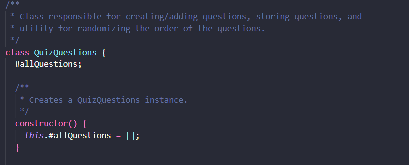

# Reflektion
## Kapitel 2 
Innehållet i kapitel 2 är enligt mig värdefullt, speciellt styckena *use intention-revealing names*, *dont be cute*, *dont pun* och *add meaningful context*. Att följa reglerna för bra namngivning är en liten ansträning som ger stort värde i förståelse för både sig själv samt för utomstånde som ska arbeta med koden eller använda modulen. I gn222gq-quiz-engine modulen så uppmärksammade jag att klassen QuestionBank bröt mot *dont be cute* regeln, se nedan :

I L3 så har jag i App.js klassen flertal kontroller med liknande namn. Jag bedömmer det mer som att jag följer en namngivningskonvention jämfört med att jag bryter mot regeln *make meaningful distinctions*, även fast jag skulle kunna se det perspektivet.

Jag har även i L3 följt regeln *avoid encodings* även i det undantagsfall av implementerande klass av interface som kan få ha "Imp" som ändelse, jag valde att döpa den implementerande klassen till DefaultAppFactory (implementerar "interfacet" AppFactory).

## Kapitel 3
Jag tycker att filosofin av att hålla klasser små, funktionsargument få och hålla funktioner till en abstraktionsnivå är värdefull även fast perspektivet presenteras något extremt för min personlig åsikt. Jag förstår värdet i tex att hålla funktions argument få, men tycker också att det finns tillfällen, som tex i min moduls kod då ett QuizObjekt skapas, då fler argument hör ihop och att bryta ut dem i olika klasser skulle göra det svårare att förstå.

Jag tycker att Stepdown rule leder till väldigt bra struktur både visuellt och förståelse mässigt. Jag har i min L3 app som implementerat MVC arkitekturen haft nytta av att följa regeln, som tex i min App class 

Det finns också tillfällen då jag upplever att bryta loss logik i mindre funktioner gör klassen i sig mer cluttered, och på så sätt gör den svårare att förstå. Ex så har jag försökt refaktorera bifogad koddel, men upplever att namngivningen blir svår att göra distinktioner på vad som faktiskt sker och därav har valt att ha flera logiska moment i samma funktion, men som enligt mig är på samma abstraktionsnivå.

## Kapitel 4
Jag håller till största del med om innehållet i kapitlet. Mumbling, redudant och noise comments förstör läsbarheten till stor grad för mig personligen. Jag har även som student fått uppeleva hur dåliga kommentarer blir när dem är ett krav, när dem skrivs enbart "bara för att.". I min applikation har jag valt att följa råden, framförallt genom att skriva kod med beskrivande namn samt att försöka att bidra med värde i kommentarerna. Dock använder jag javascript och väljer att ha kommentarer vid funktionalitet som egentligen inte behöver vidare förklaring, för att få lite "typsäkerhet" via jsdoc för att förenkla vidareutvecklingen av applikationen. Författaren referar till att det är bra att använda Javadoc för publika APIer men oftast inte för systemets icke publika apier, det blir en aspekt som jag bryter mot då jag även har jsdoc kommentarer för icke publika apier i min modul för "typsäkerheten". Jag har dock valt att inte ha kommentarer för getters och setters för minskat noise.

## Kapitel 5
Jag tyckte att det var intressant att förstå hur mycket kodningsstilen/formateringen påverkar framtida underhåll och utökbarheten av koden. Jag tycker att det kan vara en svår balans mellan *the newspaper metaphor* och *vertical distance*, där jag personligen tycker att det är viktigare med att ha så lite *vertical distance* mellan metoden som kallar en annan metod, med nedåtriktad riktning, jämfört med att gå från hög nivå till låg nivå mer övergripande. 

I min egna kod hade jag inte initialt implementerat en specifik formaterings guide/regelverk, och valde att använda airbnb javascript stil guide med tillägg av regeln i EsLint av att varna då filer innehåller mer än 500 rader i linje med boken. Merparten av koden var välformatterad, men en del ändringar gjordes. I vissa fall i modulen fick formatteringsregler ignoreras men detta var inte direkt kopplat till formatering utan mer funktionella aspekter.

## Kapitel 6
Detta kapitel var för mig ett av de intressantaste, förklarandet av skillnaden mellan objekt och datastrukturer samt tanken på hybrider var något jag inte hade reflekterat över tidigare. Min kodbas följde riktlinjerna till största del, även The law of demeter, som jag tycker är en regel som känns relativt enkel att följa men som medför stora fördelar minskade beroenden, främjar moduläritet och ökar läsbarheten. Jag upptäckte att min Question klass hade "bean" formatet av ett data struktur (privata instansvariabler med getters och setters), jag valde att behålla formatet jämfört med att refaktorera till en mer renodlad data struktur för att kunna validera tillskrivningsargumenten i setters. Jag håller inte helt med train wreck stycket, personligen tycker jag att 1-2 callbacks kan göra något enklare att förstå jämfört med för många instansierade variabler, men jag förstår också värdet av att göra interfacet på ett objekt mer abstrakt för att kunna åtstadkomma ett likvärdigt resultat som flertal callbacks.

## Kapitel 7
Jag tycker att kapitlet var väldigt givande. Felhantering är något som jag upplever som lite omständigt/svårt. Det var intressant att läsa stycket *write your try catch first*, med en slags TDD i just scopet som hade skapats av att göra try catch först. Jag har också fått uppleva varför *use unchecked exceptions* en bra idé när jag arbetade i ett annat projekt med Java, där hela inkapslingen bröts och flera filer fick redigeras. I min egna kod så bytter jag ut generiska Error klassen mot mer beskrivande klasser för att följa *Define Exception Classes in Terms of a Caller’s Needs*.

## Kapitel 8
För mig var kapitlet väldigt intressant, jag hade aldrig tidigare tänkt på *boundaries* inom kod. Jag har heller tidigare aldrig skrivit eller använt mig av wrappers, och inte riktigt förstått syftet men jag tycker att kapitlet förklarade det bra. Jag tycker att idén av att ha *clean boundaries* med både wrappers och tester (för inlärning och för att upptäcka feature changes) var väldigt intressant. I min egna kod så använde jag en klass ChartGenerator, för att wrappa funktionalitet från ett tredjeparts paket. Det fanns dock inga tester för den *boundary* som utgjordes mellan ChartGenerator och chart.js (tredjeparts paketet), så enhetstester som testade den funktionalitet av chart.js som ChartGenerator nyttjade skapades.

## Kaptiel 9
Jag håller med om delarna i kapitlet. Mina tankar kring TDD är att det verkar som ett optimalt sätt att utveckla produktionskod på, att följa *the three laws of TDD* framstår som en effektiv iteration att ha som utvecklare. Mina enhetstester följde *F.I.R.S.T* principerna vid skapandet av dem, men samma omsorg hade inte givits när det kom till struktur och namngivning av dem så vissa enhetstester refaktorerades för att skapa mer *clean tests*. Jag har nu större förstålese till hur viktigt det är att lägga minst samma omsorg till tester, samt hur tester egentligen är en integrerad del av skapa kodstycken med hög kvalitet, som samtidigt är läsbara och lättförståeliga.

## Kapitel 10
Stora delar av kapitlet går i linje med dem värderingar och tekniker som har förmedlats i kurserna om Objekt Orienterad programmering, vilket jag håller med om helt. Mina klassers strukturer följer rekommendationen som ges i *class organization*. Jag håller även med om *the single responsibility principle*, men tycker samtidigt att abstraktionsnivån för vad en sak är kan skilja sig. Högre nivåer av en sak, ex "hanterar frågorna" som QuestionManager eller "initierar kontrollflöde" som App.js i L3 appen tycker jag är rimligt, så länge klassen inte blir ett *god object*. I min applikation så ledde appliceringen av MVC arkitekturen till klasser med generellt hög cohesion, tex så använder alla controller en av sina medlems variabler i varje metod och flera gånger så används flertalet variabler. Mina EsLint regler varnar också ifall en metod i en klass inte använder en egen variabel, för att hålla koll på cohesionen. Jag frångick den regeln för privata validerings metoder, och tycker att det skapar en tydligare bild att ha kvar dem i klassen där valideringen sker för att få bättre läsbarhet. 

## Kapitel 11
Vissa delar av kapitel 11 var inte nya, såsom användandet av *abstract factory* mönstret och *dependency injection* mönstret. I min kod används dependency injection som huvudsätt för klasser att få klasser som dem är beroende av. Andra delar av kapitlet var helt nytt, såsom cross cutting concerns. Jag hade inte läst eller hört om *AOP*, och var tvungen att söka mer information om ramverk som möjligjorde Aspects i Java, och tar med mig nya insikter för framtida projekt. Jag omarbetade min App.js klass då jag insåg att den båda initierade applikationen och kontrollerade flödet av applikationen (bryter mot separation of concerns). Jag valde att implementera *abstract factory pattern* för skapandet av objekt och separera uppstart och kontroll.

